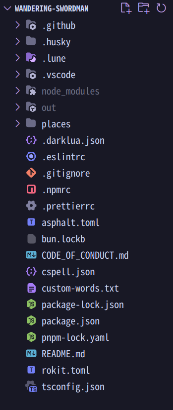
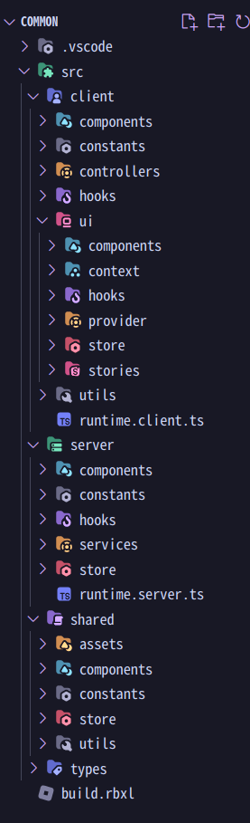

# Locations

## Top Directory

:::warning
**Do not touch anything started with a `.` unless you know exactly what you are doing**
:::
* `.github`: Pull request template, workflows including CI/CD are all located here. 
* `.husky`: A package that deals with git hooks, specifically for pre commits.
* `.lune`: Luau scripts that modifies local roblox place files.
* `node_modules`: External packages we installed
* `out`: A useless folder when we compile stuff
* `places`: All the *actual* code that we will be touching.
* `.darklua.json`: Configurations for darklua parser 
* `.eslintrc`: Configurations for eslint
* `.gitignore`: All the files we ignore when committing to github
* `.npmrc`: Dependency configurations when dealing with `pnpm` package manager
* `prettierrc`: Configurations for prettier
* `asphalt.toml`: Configurations on how to sync assets to Roblox
* `bun.lockb`: A lock file to retrieve files quicker for `bun` package manger
* `CODE_OF_CONDUCT.md`: Rules on whats professional, whats not.
* `cspell.json`: Spelling configurations for cspell
* `custom-words.txt`: A text file to define custom words not recognized by cspell
* `package-lock.json`: A lock file to retrieve files quicker for `npm` package manger
* `pnpm-lock.yml`: A lock file to retrieve files quicker for `pnpm` package manger
* `README.md`: A text file that is shown in the front repository
* `rokit.toml`: All the exe tools we will be installing
* `tsconfig.json`: Specifies how the compiler will compile roblox-ts code to luau

## Working Directory


The working directory into three main folders: 

* `client`: StarterPlayerScripts
* `server`: ServerScriptService
* `shared`: ReplicatedStorage
* `types`: N/A, Type definitions

The main reason why we don't need `StarterGui` is because all the UI logic is handed by [react](https://react.dev/?uwu=true). We also don't need `ReplicatedFirst` since ReplicatedStorage does a good job with handing that logic.

---

### Components
Under `client`, `server`, `shared`. You can see `components` folder, if we decide to use [ECS](https://matter-ecs.github.io/matter/) for our game. It will represent the components in our system. If we use [flamework/components](https://flamework.fireboltofdeath.dev/docs/additional-modules/components/creating-a-component), it will represent the components we make.

### Utils
We can also see `utils` folder in `client`, `server`, `shared`. Those represent utility functions. For example, lerping, or calculate a certain object and return a result.

---

### Store
The `store` folder stores all the server state, client state. However, we plan to remove `store` for `shared` folder or put [delta compress](https://github.com/nezuo/delta-compress) to handle shared states. The state we declare will use [charm](https://github.com/littensy/charm/). 
:::details EXAMPLE
::: code-group
```ts [src/server/store/save.ts]
import { atom } from "@rbxts/charm";

//the atom should be called `example` and end with Atom
export const saveAtom = atom(new ReadonlyMap<number, PlayerSave>());

//Selectors, inspired by reflex is supposed to retrieve data with given parameters
export const selectPlayerSave = (userid: number) => () => saveAtom().get(userid);
```
:::

---

### Hooks
`hooks` folder represents flamework lifecycle events, they appear in `client` and `server` directory. To not confuse with `ui`'s `hooks` folder is different. 

:::details EXAMPLE
::: code-group
```ts [src/server/hooks/index.ts]
export interface OnPlayerJoined {
	onPlayerJoined(player: Player): void;
}
```
```ts [src/server/hooks/player.ts]
@Service()
class PlayerJoinService implements OnStart {
	onStart() {
		const listeners = new Set<OnPlayerJoined>();

		// Automatically updates the listeners set whenever a listener is added or removed.
		// You can do more than just keeping track of a set,
		// e.g fire the new listener's event for all existing players.
		Modding.onListenerAdded<OnPlayerJoined>((object) => listeners.add(object));
		Modding.onListenerRemoved<OnPlayerJoined>((object) => listeners.delete(object));

		Players.PlayerAdded.Connect((player) => {
			for (const listener of listeners) {
				task.spawn(() => listener.onPlayerJoined(player));
			}
		})

		for (const player of Players.GetPlayers()) {
			for (const listener of listeners) {
				task.spawn(() => listener.onPlayerJoined(player));
			}
		}
	}
}
```
:::

---

### Constants
The `constants` folder located in `client`, `server`, `shared` has immutable global values used across different code. For example `LOCAL_PLAYER`, it represents `Players.LocalPlayer`. It can be shared across code. 

---

### Services/Controllers
The `services`/`controllers` folder stores all the [flamework services](https://flamework.fireboltofdeath.dev/docs/guides/creating-a-singleton) It is mentioned in flamework v2 that `service`/`controller` will be named as `provider` instead. 
:::details EXAMPLE
::: code-group
```ts [src/server/services/basic-service.ts]
import { Service, OnTick } from "@flamework/core";

@Service()
export class MyService implements OnTick {
	onTick(dt: number) {
		print("My service is ticking", dt);
	}
}
```
```ts [src/client/basic-controller.ts]
import { Controller, OnRender } from "@flamework/core";

@Controller()
export class MyController implements OnRender {
	onRender(dt: number) {
		print("My controller is rendering", dt);
	}
}
```
:::

---

### Runtime
`runtime.server.ts` and `runtime.client.ts` is located in `server` and `client` folder. They load flamework services/controllers and is not intended for modification. 

---
