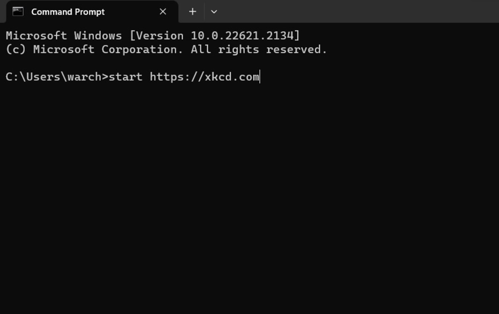

# Terminal
---
:::info what is a terminal?
"A terminal is essentially a text-based user interface for interacting with computers. It allows users to execute commands and view the results, as well as control applications running on the computer. A terminal can be used to access the command line interface (CLI) of an operating system, such as Windows or Linux." - Google
:::

## Where do I open one?

:::details I don't have terminal!
It is completely fine! You can use other tools such as `Powershell`, `Command Prompt`, `Git Bash`. 
:::
:::warning
I am unsure if `Command Prompt` supports all the tools you have installed. If some commands doesn't work on your terminal, its best to open `Git Bash`
:::

## What does it look like?

Nothing special, just a black screen where you can type stuff.

## Terminal crash course
* `Directory`: The folder you are in
* `Location`: The prefix you see before you can type anything
You can switch locations by using `cd`. `ls` to show all the files in the directory. `start` or `open` to open a file. 

## Paths
* `..` is parent directory
* `.` is current directory
* `/` is relative path
For example, you want to go the the directory `foo` you would do
```bash
cd foo
```